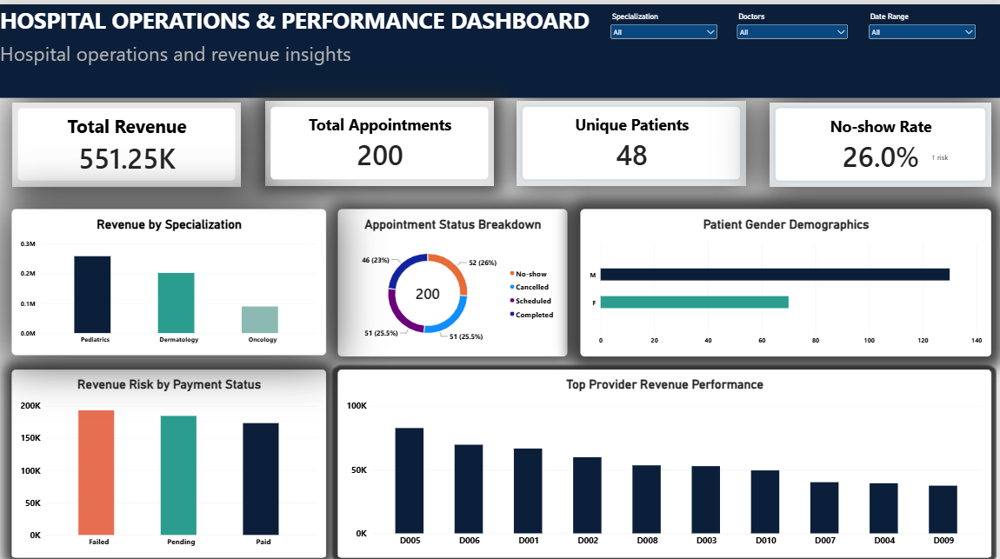

# Hospital Operations & Performance Dashboard

A full-stack data analytics project analyzing hospital operations using a 5-table relational database. Built 10+ SQL queries (joins, aggregations, subqueries, window functions) to uncover revenue trends, doctor performance, and appointment patterns, then visualized the findings in an interactive Power BI dashboard.




## Problem Framing

Hospital administrators need visibility into where revenue is coming from, which appointments are being missed, and where billing is breaking down. This project answers: *Which departments and doctors drive the most revenue? How many appointments are lost to no-shows and cancellations? How much revenue is at risk from unpaid bills?*

## Tech Stack

- **Database:** SQLite (5 relational tables with primary/foreign keys)
- **Analysis:** Python (Pandas) for data cleaning and EDA
- **Querying:** SQL (joins, aggregations, subqueries, window functions)
- **Visualization:** Power BI (KPI cards, bar charts, donut chart, dashboard)

## Database Schema

```
patients (patient_id PK)
  └──< appointments (appointment_id PK, patient_id FK, doctor_id FK)
         └──< treatments (treatment_id PK, appointment_id FK)
                └──< billing (bill_id PK, patient_id FK, treatment_id FK)
doctors (doctor_id PK) ──< appointments
```

- **patients** (50 rows) — demographics, insurance, registration info
- **doctors** (10 rows) — specialization, experience, branch
- **appointments** (200 rows) — links patient + doctor, status, reason for visit
- **treatments** (200 rows) — treatment type, cost, linked to an appointment
- **billing** (200 rows) — payment amount, method, status, linked to a treatment

## Key Insights

- **26% of appointments ended in a no-show**, and another 25.5% were cancelled — together, over half of scheduled appointments did not result in a completed visit.
- **68% of billing is stuck in Pending (34.5%) or Failed (33.5%) status** — only 32% of bills are marked Paid, representing significant revenue at risk.
- **Pediatrics generates the highest revenue** ($258,937.83 across 98 appointments), ahead of Dermatology ($202,709.29) and Oncology ($89,602.73).
- **Patient base skews male** (62% male vs. 38% female).
- Top individual revenue-generating doctor: **Sarah Taylor (Dermatology)**, at $82,696.48.

## SQL Techniques Demonstrated

See [`queries.sql`](queries.sql) for the full set. Highlights:
- **Joins** across all 5 tables to build a full patient-visit history
- **Aggregations** (GROUP BY, HAVING) for revenue by specialization and above-average doctor workload
- **Subqueries** to flag patients never billed and above-average-cost treatments
- **Window functions** (RANK, running SUM, ROW_NUMBER) to rank doctors by revenue and find each patient's most recent visit

## Project Files

| File | Purpose |
|---|---|
| `create_db.py` | Builds the SQLite database and loads the 5 CSVs with proper schema |
| `queries.sql` | All 10 SQL queries (joins, aggregations, subqueries, window functions) |
| `run_queries.py` | Runs and validates all queries against the database |
| `analysis.py` | Python/Pandas data quality checks, EDA, and export for Power BI |
| `hospital_master_data.csv` | Clean, flattened dataset used to build the Power BI dashboard |
| `dashboard_screenshot.png` | Final dashboard screenshot |

## How to Run

```bash
pip install pandas
python create_db.py       # builds hospital.db from the CSVs
python run_queries.py     # runs all SQL queries
python analysis.py        # data quality checks + exports hospital_master_data.csv
```

Then open `hospital_master_data.csv` in Power BI Desktop to rebuild the dashboard.

## Dataset

[Hospital Management Dataset](https://www.kaggle.com/datasets/kanakbaghel/hospital-management-dataset) (Kaggle, kanakbaghel)
